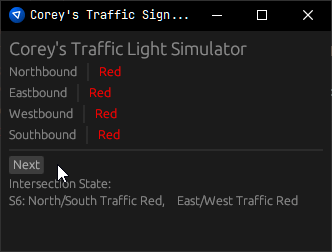
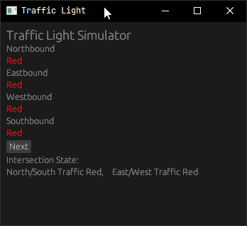

# Traffic Simulator

A basic traffic simulator built in Rust with egui as the frontend. Working through "assignment prompts" I created with GPT4, which can be found in [/assignment_prompts/](/assignment_prompts/).

## Progress

### 0.2.0 : Assignment 1, w/ Improvements

### 0.1.0 : Assignment 1
